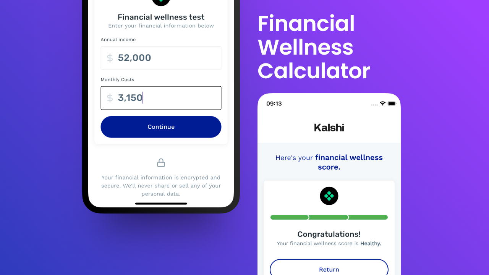

# Financial Wellness Calculator - by Lucas M. Braz



## Getting Started 🚀

### Prerequisites

To run this project you must have the [Flutter SDK](https://docs.flutter.dev/get-started/install) installed on
your machine.

### Running the Project

To run the application, do:

```sh
# Get Dependencies
$ flutter pub get

# Run the app
$ flutter run
```

## Project Architecture 🏡

The project follows the [BLoC architecture](https://bloclibrary.dev/architecture/) with a feature-based folder
structure. This architecture separates the application into three layers: presentation, business logic, and
data. However, not every feature needs all three layers, so the developer can implement only the necessary
ones.

These are the app's current features and their respective layers:

- **Score Calculator**: Presentation and Business Logic
- **Score Results**: Presentation

### Cubit vs. BLoC

Cubit is favored over BLoC for its simplicity and ease of use, but since they work interchangeably, the developer can
choose to use BLoC if it is better suited for the job.

## Folder Structure 📂

In summary, each feature receives a top-level folder to contain all of its files organized by type. Elements that are
shared between features are placed in the `shared` folder.

Here's a breakdown of the project's structure:

```
/lib
└── score_calculator/   <-- Feature
    └── view/               <-- Pages & Widgets (Presentation)
    └── cubit/              <-- Business Logic
└── score_results/
    └── view/
└── shared/             <-- Shared Elements
    └── extensions/
    └── models/
    └── widgets/
```

### Barrel files

This project makes use of barrel files to simplify imports and enhance code organization.

## Design System 🎨

Foundational UI elements and standards such as theme, colors, typography, and reusable components (buttons, input
fields) comprise a design system. These elements are app-agnostic and can be used across different projects of the
organization.

They are placed in a separate package (under `/packages/design_system`) to allow reusability and easy maintenance.

## Testing 🧪

Automated testing is a crucial part of the development process and ensures that the app behaves as expected. This is
especially important as the project grows and new features are added.

The project is currently set up with unit tests for the business logic layer and widget + golden tests for the
presentation layer.

**Important:** The goal of the project is to keep the test coverage above 90%.

These are some useful commands to run the tests:

```sh
# Run all tests
$ flutter test

# Run all tests and generate coverage report
$ flutter test --coverage
$ genhtml coverage/lcov.info -o coverage/html

# Update golden files
$ flutter test --update-goldens
```

## Declarative vs Imperative Programming

Declarative programming describes what should happen, while imperative programming describes how to achieve it. As the
project grows, it's important to favor declarative programming to make the code more readable, testable and
maintainable.

For example, the score calculation could be implemented imperatively like so:

```dart
ScoreRating calculateScore(double annualIncome, double monthlyCost) {
  const taxRate = 0.08;
  final netIncome = annualIncome * (1 - taxRate);
  final annualCost = monthlyCost * 12;
  final costRatio = annualCost / netIncome;
  return switch (costRatio) {
    <= 0.25 => ScoreRating.healthy,
    <= 0.75 => ScoreRating.average,
    _ => ScoreRating.unhealthy,
  };
}
```

This would've been fine for the project's current size, but with scalability in mind, we chose a declarative approach
that helps with unit testing as well as code reuse.

The example below shows WHAT, a net income, rather than HOW to calculate it:

```dart

final grossIncome = 1000.money;
final taxRate = 0.08.taxRate;
final netIncome = NetIncome(grossIncome: grossIncome, taxRate: taxRate);
```